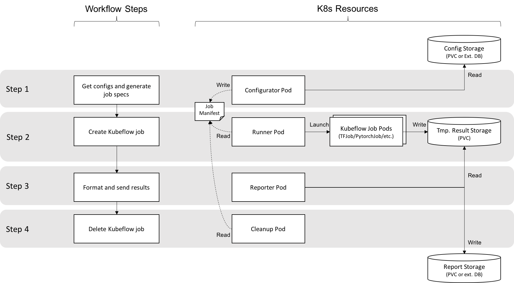

# Kubebench Design

## Motivation

Benchmarking is an essential part in deep learning researches and productizations. Today, Kubeflow does not provide a straightforward workflow that enables people to run benchmark tasks easily, especially for distributed training jobs.

## Goal

The goal of Kubebench is to provide a workflow that makes it easy to run benchmark jobs on Kubernetes with different system/model settings, and to provide easy access to the benchmark results for other applications. The workflow should be generic enough to support various configurations, including different DL frameworks, different cluster sizes, different GPU numbers/types, different problems/datasets, etc. Kubebench should be installable on Kubeflow as a Ksonnet package.

## Non-Goal

We should not try to re-invent another benchmark tool from scratch but try and reuse bits and pieces from some interesting [prior work](https://github.com/kubeflow/kubeflow/issues/596). This work should focus on how to deploy and manage benchmark jobs within the Kubeflow context. That being said, we will take existing tools (with possible modifications) as starting point and adapt them into Kubeflow framework.

## Design

A benchmark job can be considered as a combination of a Kubeflow job (here the "Kubeflow Job" refers to a K8s custom resource defined by Kubeflow, e.g. TFJob, PyTorchJob, etc. Same below), and a set of utility jobs (i.e. config preparation, result reporting, etc.). The Kubebench project leverages Kubeflow to deploy benchmark jobs, and provides an Argo workflow that wires up utility functionalities such like configuration and reporting. The workflow is demonstrated in Fig 1.

Fig 1 Kubebench workflow

- Get Config: the first step gets a benchmark config, which can be passed in from external storage (PVC) or DB. The benchmark config can contain both system settings (e.g. framework type/version, cluster size, etc.) and model parameters (e.g. model type, batch size, etc.). The job parses the config and produces a manifest that defines a Kubeflow job.

- Run job: a Kubeflow job is created using the output above. The images used to run the job may be derived from available benchmark tools.

- Send results: when the job is done, a single container collects the logs/outputs from finished jobs, produces the results to be reported, and then send the results to user-specified external storage (e.g. PVC or DB). This step might be optional if the benchmark job is a single container and includes result reporting by itself. However this step might be necessary for cluster based distributed trainings.

- Clean up: eventually the kubeflow jobs created above are deleted.

## Additional notes

- The initial design of Kubebench allows running a single benchmark job at a time, we may extend it so that it can run through a list of configs automatically.
